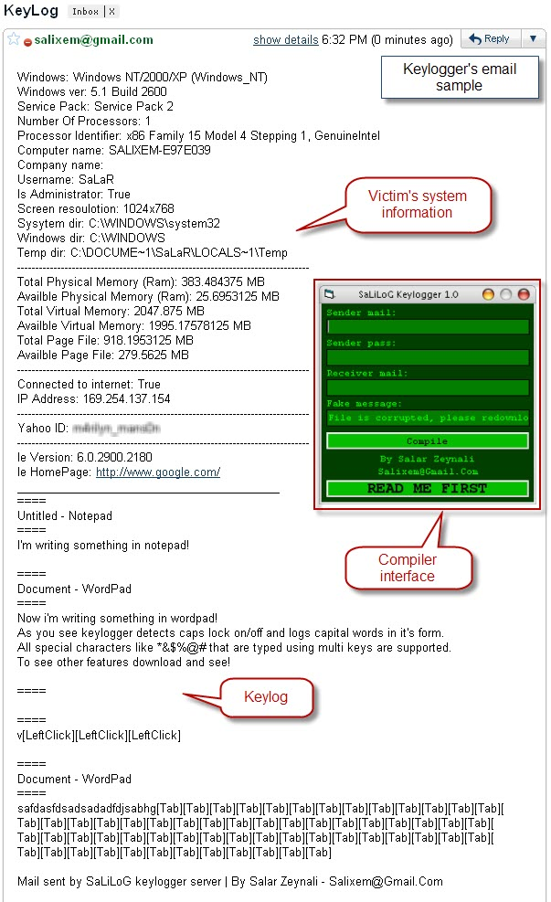



## SaLiLoG \- Complete mailer keylogger with server compiler and other features \[Bug fixed\]

### Description

SaLiLoG is a powerful keylogger application that sends keylogs to your email.It sends victim's software and hardware and network information with the keylog (See screenshot).It copies itself to system directory and adds it to startup every 1 second to avoid being removed from startup.Also it changes process name to explorer in taskmanager to be undetected by victim.It detects title of window that victim is typing something in it and supports caps on/off and special characters.

With the server maker you create a custom server with a compiled server.Also you can add a fake message to the server to make it like corrupted program.To see other features download it!

Note that some modules are not by me and i have used some other codes to complete this application.Please suggest me your ideas to improve this app.

DON'T FORGET TO PRESS "READ ME FIRST" BUTTON IN SERVER MAKER!
 
### More Info
 

             |
---                |---
**Submitted On**   |2009-09-26 19:23:18
**By**             |[SaLiXeM](https://github.com/Planet-Source-Code/PSCIndex/blob/master/ByAuthor/salixem.md)
**Level**          |Advanced
**User Rating**    |5.0 (30 globes from 6 users)
**Compatibility**  |VB 6\.0
**Category**       |[Complete Applications](https://github.com/Planet-Source-Code/PSCIndex/blob/master/ByCategory/complete-applications__1-27.md)
**World**          |[Visual Basic](https://github.com/Planet-Source-Code/PSCIndex/blob/master/ByWorld/visual-basic.md)
**Archive File**   |[SaLiLoG\_\-\_2163539272009\.zip](https://github.com/Planet-Source-Code/salixem-salilog-complete-mailer-keylogger-with-server-compiler-and-other-features-bug-fixe__1-72490/archive/master.zip)

